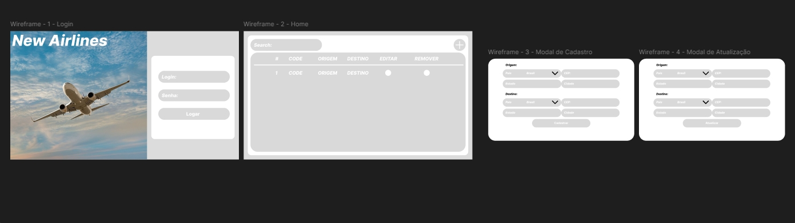

# NEORON Flight Management System - Frontend

## Descrição

Este repositório contém o frontend da aplicação de gerenciamento de voos da empresa de aviação, desenvolvido com **Next.js**. O objetivo do frontend é fornecer uma interface intuitiva e de fácil uso para os funcionários da empresa, permitindo a visualização, criação e edição de voos.

## Tecnologias

- **Next.js**: Framework JavaScript para construção da interface de usuário.
- **Tailwind.css**: Framework de CSS utilitário que oferece uma maneira rápida e eficiente de criar interfaces de usuário (UIs) sem escrever CSS personalizado.

## Requisitos do Sistema

- **Node.js** (v14 ou superior)
- **npm** (v6 ou superior)

## Instalação e Configuração

1.  Clone este repositório:

    `git clone https://github.com/neoron-challenge/frontend.git`

cd frontend`

2.  Instale as dependências:

    `npm install`

3.  Inicie o servidor de desenvolvimento:

    `npm run dev`

4.  Acesse a aplicação no navegador:

    `http://localhost:3000`

## Funcionalidades Principais

- **Listagem de Voos**: Exibe a lista de voos registrados no sistema, com opções para filtrar e ordenar.
- **Cadastro de Voos**: Formulário para adicionar novos voos com base nas regras de negócio.
- **Edição de Voos**: Possibilidade de editar os dados de um voo existente.
- **Validação de Regras de Negócio**: O sistema garante que não serão criados dois voos para o mesmo destino no mesmo dia, e que haverá pelo menos 30 minutos de diferença entre os voos.

## Documentação

- **Figma**: [Link para o design](https://www.figma.com/design/2CafTFKGGufOGCRwL7b9VO/Neoron-Test---Figma?node-id=0-1&node-type=canvas&t=gAGmbURtT5hsDg4L-0/)
